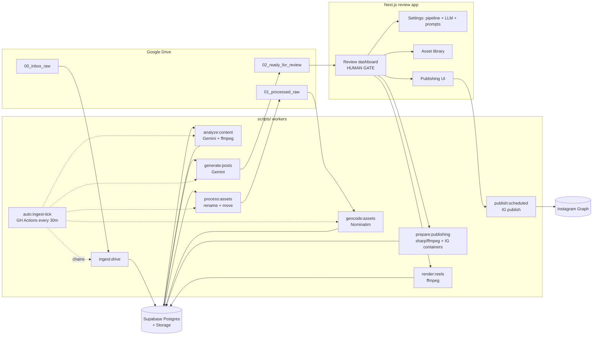
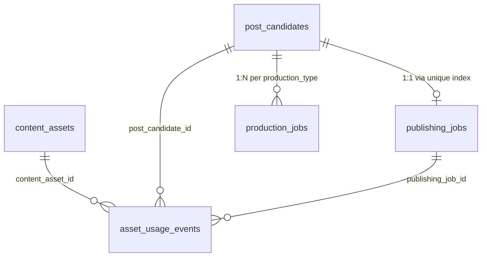

# France94 Content Manager — repo audit

**Repo root:** `/Users/jimmy-peakscape/france94_contentManager`
**Scope inspected:** root scripts + `scripts/lib/**` + `web/**` + `supabase/migrations/**` + `prompts/**`. Skipped `node_modules/`, `.next/`, `.git/`.
**Audit date:** 2026-05-28. Reflects working tree, including ~10 staged-but-uncommitted files (composed-prompt migration).

---

## 1. Architecture map

Two deployables sharing one codebase:

- **Batch workers** (Node CLI, `tsx`) under [scripts/](scripts) — the content pipeline.
- **Next.js 15 review app** (App Router, React 19, Tailwind 4) under [web/](web) — the human gate plus settings + asset library + publishing UI.

They share libraries under [scripts/lib/](scripts/lib), exposed to the web app through TypeScript path aliases (`@fr94/ai/*`, `@fr94/publishing/*`, `@fr94/asset-usage`) configured in `web/tsconfig.json`. The `web` workspace has no `@fr94` dependency in `package.json` — resolution is path-only and the web build trampolines `.js` specifiers back to `.ts` via `webpack.resolve.extensionAlias` in [web/next.config.ts](web/next.config.ts).

Authoritative state lives in **Supabase Postgres**. Google Drive is treated as storage only (per `.cursor/rules/google-drive.mdc`). LLM = Google Gemini, image/video = `sharp` + `ffmpeg-static`. Publishing target = Instagram Graph API.

Deployment surface:

- **Vercel** hosts only [web/](web) (Root Directory = `web`). Single repo-root `.env` is loaded by `next.config.ts`.
- **GitHub Actions** runs [.github/workflows/auto-ingest.yml](.github/workflows/auto-ingest.yml) every 30 min → `npm run auto:ingest-tick`. Workers are too heavy for Vercel.
- **Supabase** = Postgres + Storage (`PUBLIC_MEDIA_BUCKET_NAME`) + Auth (Google OAuth).

---

## 2. Data flow map

End-to-end status flow with the human gate:

```mermaid
flowchart LR
  N["content_assets: new"] --> AZ["analyzing"] --> A["analyzed"] --> RN["renaming"] --> P["processed"]
  P -->|"eligibility=eligible"| GEN["generate:posts"]
  GEN --> NR["post_candidates: needs_review"]
  NR -->|"reviewer in web"| AP["approved"]
  NR --> REJ["rejected"]
  NR --> NRW["needs_rewrite then regenerate"]
  NRW --> NR
  AP -->|"reel: web inserts production_jobs row"| PJ_Q["production_jobs: queued"]
  PJ_Q --> REN_R["rendering"] --> PJ_P["produced"]
  AP -->|"prepare:publishing"| PB_D["publishing_jobs: draft"]
  PJ_P --> PB_D
  PB_D --> PB_MP["media_prepared"] --> PB_C["containers_created/processing"] --> PB_R["ready_to_publish"]
  PB_R -->|"web schedule"| PB_S["scheduled"] --> PB_PG["publishing"] --> PB_DONE["published"]
  PB_R -->|"web publish now"| PB_PG
  PB_R -->|"sync"| RTP["post_candidates: ready_to_publish"]
```

Asset reservations and the asset-usage ledger ride alongside this flow:

- On candidate approve, `recordAssetUsageEvent('approved')` reserves source assets (`content_assets.usage_status='approved_pending'`).
- On publishing-job `ready_to_publish`, final published usage is recorded for warnings/reporting; asset reuse is not hard-blocked.
- Reconciliation endpoint repairs stale approvals: `POST /api/content-review/reconcile-asset-reservations`.

---

## 3. Main domain objects

- **`content_assets`** — every Drive file ever ingested. Owns analysis output (visual/transcript summaries, scores, lanes, nonverbal cues, geo, EXIF), filename plan, processing flags, and asset-usage summary (`usage_status`, `usage_count`, `candidate_eligibility`, `hard_locked`).
- **`post_candidates`** — planner output. Owns post type, captions FR/EN, hashtags, structured payloads (`story_frames`, `reel_instructions`, `carousel_slides`, `static_post_instructions`), `source_asset_ids[]` (no FK), reviewer audit (`reviewed_at/by`, `reviewer_notes`), conflict flags (`has_asset_conflict`, `freshness_warning`).
- **`publishing_jobs`** — Instagram preparation/execution per candidate. Owns `prepared_media` (JSONB), public URLs, IG container IDs + statuses, scheduling, permalink. **One job per candidate** (unique index on `post_candidate_id`).
- **`production_jobs`** — reel rendering (currently `production_type='reel'`). Owns render instructions and output. **Unique** `(post_candidate_id, production_type)`.
- **`asset_usage_events`** — append-ish ledger (currently RLS allows DELETE). FK to all three above. Drives reservations, conflict detection, last-published bookkeeping.
- **`pipeline_settings`** — singleton row. Auto-ingest on/off, threshold, interval, `enabled_post_types` (JSONB), last-run telemetry.
- **`llm_route_settings`** — per-operation model + temperature + max tokens + thinking level + flags. PK = `operation` (9 allowed).
- **`llm_stable_prompts`** — per-key prompt body. PK = `prompt_key` (17 allowed after [supabase/migrations/20260528120000_llm_stable_prompts_context_task_keys.sql](supabase/migrations/20260528120000_llm_stable_prompts_context_task_keys.sql)).
- **`llm_prompt_caches`** — Gemini explicit-cache registry (cache resource names + TTL).
- **`llm_call_logs`** — every Gemini call (tokens, latency, success, metadata). Surfaced by `fr94_llm_usage_*` SQL functions.

Cross-table ER:

`source_asset_ids uuid[]` on `post_candidates`, `publishing_jobs`, `production_jobs` is **logical only — not FK-enforced.**

---

## 4. State management model

### Backend / pipeline
Status columns are the source of truth. Optimistic claims use `eq('status', expected)` updates (e.g. `markAssetAnalyzing` in [scripts/analyze-content-assets.ts](scripts/analyze-content-assets.ts), `claimAssetRenaming` in [scripts/process-analyzed-assets.ts](scripts/process-analyzed-assets.ts)). **Safe for one worker per pipeline stage; not safe for parallel workers** (no row-level lock, no fencing token).

### Web app
**Zero global stores. No Context, Zustand, SWR, or TanStack Query.**

- Local `useState`/`useCallback`/`useEffect` per page.
- Shared HTTP helper `readJsonResponse` in [web/lib/read-json-response.ts](web/lib/read-json-response.ts).
- **Optimistic updates** on decision + notes in [web/app/content/review/ReviewDashboard.tsx](web/app/content/review/ReviewDashboard.tsx) (~699 LoC), with rollback on error.
- **Module-level `Map` cache** for review-folder media in `useCandidateMedia`, plus a `mediaReloadNonce` and a generation counter against stale responses.
- **URL state**: filters via `useSearchParams()`; not all filter changes write back to the URL.
- **No server actions** (`"use server"` is not used anywhere). All mutations go through `app/api/**` route handlers.

The settings page [web/app/content/review/settings/page.tsx](web/app/content/review/settings/page.tsx) (~1426 LoC) carries pipeline status + LLM route table + stable prompts editor + usage charts in a single client component — the largest single state owner in the app.

---

## 5. API routes / server actions

No Server Actions. All API routes live under [web/app/api/](web/app/api).

### Auth
- `POST /api/auth/signout` — clears Supabase session cookies.
- `GET /auth/callback` — exchange OAuth code, allowlist check, redirect to `next`.

### `/api/content-review/candidates`
- `GET candidates` — list/filter (`status`, `post_type`, `candidate_date`, `priority_min`, `q`, …).
- `GET / PATCH candidates/[id]` — detail; PATCH writes `status`, `reviewer_notes`, captions, hashtags, `reel_instructions`; on **approve**, reserves assets via `recordAssetUsageEvent('approved')`, and **upserts a `production_jobs` row** for reels.
- `POST candidates/[id]/regenerate` — runs `task_regenerate_with_notes` via [web/lib/post-candidate-rewrite.ts](web/lib/post-candidate-rewrite.ts) (Gemini → Zod → DB).
- `GET candidates/[id]/files` and `POST candidates/files-bulk` — list/thumbnail files in `review_drive_folder_id` (Google Drive).
- `DELETE candidates/[id]/review-assets/[fileId]` — Drive `files.delete`, updates `source_*_ids`, prunes structure via [web/lib/prune-candidate-structure-for-asset.ts](web/lib/prune-candidate-structure-for-asset.ts).
- `GET / PATCH candidates/[id]/video-transcripts[/[assetId]]` — read/write `content_assets.transcript`.
- `GET drive-file/[fileId]?candidateId=` — proxy stream from Drive with Range support.

### `/api/content-review/pipeline` and LLM
- `GET / PATCH pipeline` — toggle auto-ingest, threshold, interval, lanes.
- `POST pipeline/run` — fires GitHub Actions `workflow_dispatch` (full or candidates-only).
- `GET / PUT / DELETE llm-settings` — `llm_route_settings` CRUD.
- `GET / PUT / DELETE llm-prompts` — `llm_stable_prompts` CRUD merged with repo defaults via `resolve-stable-prompt`.
- `GET llm-usage?days=` — calls `fr94_llm_usage_daily`, `_by_model_daily`, `_by_operation_daily` (RPCs).

### `/api/content-review/publishing-jobs` and `production-jobs`
- `GET publishing-jobs/[id]`, `GET publishing-jobs/by-candidate/[candidateId]`.
- `POST publishing-jobs/[id]/schedule | unschedule | refresh-status | publish-now` — Instagram Graph mutations.
- `GET production-jobs/by-candidate/[candidateId]`.
- `POST reconcile-asset-reservations` — repairs stale approved reservations.

### `/api/content-assets`
- `GET list` — assets browse with filters (eligibility/quality/used/dates/etc.).
- `GET / PATCH eligibility` — set `candidate_eligibility` + `asset_notes`; emits usage event on change.
- `POST manual-usage` — record manual usage + optional mark-stale.
- `GET preview` — Range-proxy from Drive.
- `GET [id]` — detail with usage events + candidate + publishing-job context.

### CLI entry points (declared in [package.json](package.json))
`ingest:drive`, `analyze:content`, `process:assets`, `geocode:assets`, `generate:posts`, `prepare:publishing`, `publish:scheduled`, `render:reels`, `auto:ingest-tick`, plus utilities: `oauth:google-drive`, `check:drive-token`, `check:instagram-token`, `meta:system-user:{install|generate|refresh}`, `review:dev`, `review:build`.

---

## 6. Database tables touched

All tables exist in [supabase/migrations/](supabase/migrations) after replaying 24 files. Usage logging table is **`llm_call_logs`** (not `llm_usage_logs`).

| Table | Read by | Written by | Status enum source |
|---|---|---|---|
| `content_assets` | ingest, analyze, process, geocode, generate, prepare, asset library API, asset events | ingest (`new`/`duplicate`/`error`), analyze (`analyzing`/`analyzed`/`error`), process (`renaming`/`processed`/`error`), `asset-usage.ts` (eligibility, usage_status, hard_locked) | **No CHECK**; comment in [supabase/migrations/20260515120000_content_assets_processing.sql](supabase/migrations/20260515120000_content_assets_processing.sql) |
| `post_candidates` | review APIs, asset library detail, prepare, ledger | generate (`needs_review`), review PATCH (`approved`/`rejected`/`needs_rewrite`), publishing-state (`ready_to_publish`) | **No CHECK**; comment in [supabase/migrations/20260516120000_post_candidates.sql](supabase/migrations/20260516120000_post_candidates.sql) |
| `publishing_jobs` | publishing routes, prepare, publish-scheduled, ledger | prepare, IG refresh/publish, web schedule/unschedule | **CHECK** in [supabase/migrations/20260520120000_publishing_jobs_scheduling.sql](supabase/migrations/20260520120000_publishing_jobs_scheduling.sql) |
| `production_jobs` | production-jobs route | review PATCH (insert on approve reel), `render-reel-jobs.ts` (`rendering`→`produced`/`failed`/`needs_manual_production`) | **CHECK** in [supabase/migrations/20260521120000_production_jobs.sql](supabase/migrations/20260521120000_production_jobs.sql) |
| `asset_usage_events` | review, asset library, prepare | `recordAssetUsageEvent` + `onPublishingJobStatusTransition` in `asset-usage.ts` | Comment-only enums |
| `pipeline_settings` | `pipeline` routes, auto-ingest tick | `pipeline` PATCH, tick `last_run_*` updates | None enumerated |
| `llm_route_settings` | resolver, settings UI | settings UI | **CHECK** on operation + thinking level |
| `llm_stable_prompts` | resolver, settings UI | settings UI | **CHECK** on 17 keys (latest migration) |
| `llm_prompt_caches` | `gemini-cache.ts` | `gemini-cache.ts` | — |
| `llm_call_logs` | RPC functions used by `llm-usage` route | `llm-logging.ts` on every Gemini call | — |

---

## 7. Slow or risky areas

| Risk | Where | Why it matters |
|---|---|---|
| **ffmpeg/ffprobe** on large videos | [scripts/lib/video-preprocess.ts](scripts/lib/video-preprocess.ts), [scripts/lib/production/render-reel.ts](scripts/lib/production/render-reel.ts), [scripts/lib/publishing/normalize-video.ts](scripts/lib/publishing/normalize-video.ts), [scripts/analyze-content-assets.ts](scripts/analyze-content-assets.ts) | CPU + temp-disk heavy; full video buffer + frame extraction in memory |
| **Full Drive downloads** | [scripts/lib/drive-media-download.ts](scripts/lib/drive-media-download.ts) | Caps: `MAX_ANALYSIS_FILE_SIZE_MB=500`, `MAX_PUBLISHING_FILE_SIZE_MB=300` |
| **Gemini file upload + poll** | `analyzeWithGemini` / `waitForGeminiFileActive` in [scripts/lib/ai/gemini-client.ts](scripts/lib/ai/gemini-client.ts) | Up to 600s wait per file; deleted in `finally` |
| **Gemini 503 + Pro fallback** | `gemini-client.ts` | Up to 3 retries; 3.1 Pro family falls back to `gemini-2.5-pro` **without cached content** — cost/latency changes silently |
| **HEIC ingest is destructive on Drive** | [scripts/lib/heic-normalize.ts](scripts/lib/heic-normalize.ts) | Converts, uploads JPEG, **deletes original** on success; `rollbackHeicUpload` only deletes JPEG on failure — partial states possible if process dies mid-flight |
| **Process assets Drive mutation** | [scripts/process-analyzed-assets.ts](scripts/process-analyzed-assets.ts) | Rename + move; retry path exists (`error + rename success + move failed`) but inconsistent partial states can drift |
| **Parallel worker safety** | `markAssetAnalyzing`, `claimAssetRenaming` | Optimistic update on `status=X`; two workers could race on retry edges or skip rows. Today only single worker (GH Actions tick), but no enforcement |
| **Auto-ingest fan-out** | [scripts/run-auto-ingest-tick.ts](scripts/run-auto-ingest-tick.ts) | Chains 5 stages per tick; auto-pauses on review backlog but can still spike API/Drive/Gemini load |
| **Publishing prep blocking** | [scripts/prepare-publishing-jobs.ts](scripts/prepare-publishing-jobs.ts) | Normalize + upload + container poll; carousels poll many children |
| **Nominatim rate limit** | [scripts/reverse-geocode-assets.ts](scripts/reverse-geocode-assets.ts) | Sequential, 1.1s/req default; long batches if backfilling |
| **Drive proxy streams** | `app/api/content-review/drive-file/[fileId]/route.ts` and `app/api/content-assets/[id]/preview/route.ts` | Two near-duplicate Range-aware proxies; Safari/mobile finicky |
| **Service-role + weak secondary auth** | [web/lib/review-auth.ts](web/lib/review-auth.ts) `assertReviewAuthorized` | Only checks cookie name (`sb-*auth-token*`) — relies on middleware to be the real gate. Any new `/api/*` route added **outside the middleware matcher** that uses service role + this helper is effectively unauthenticated |
| **RLS uses `using (true)` for `authenticated`** | [supabase/migrations/20260509120000_content_assets_rls_policies.sql](supabase/migrations/20260509120000_content_assets_rls_policies.sql) (and similar) | Single-operator app is fine; adding multi-user without tightening policies exposes every row |
| **Migration ordering risk** | [supabase/migrations/20260511130000_publishing_jobs.sql](supabase/migrations/20260511130000_publishing_jobs.sql) references `post_candidates`, which is only created in [supabase/migrations/20260516120000_post_candidates.sql](supabase/migrations/20260516120000_post_candidates.sql) | A **fresh `supabase db reset`** in lexicographic order should fail. Existing dev/prod DBs likely worked because migrations were applied out of order historically. Will bite you next environment |
| **Circular FK** | `publishing_jobs.post_candidate_id` ↔ `post_candidates.publishing_job_id` | Both nullable; OK in practice, but app must insert in the right order; Postgres can't defer these |
| **`.gitignore` excludes `*.sql`** | [.gitignore](.gitignore) | Migrations are still tracked (they were committed before the rule), but **new migrations created locally will not show up under `git add`**. Footgun: anyone adding a migration with `git add .` may think it was committed |
| **JSONB shape ownership** | `prepared_media`, `story_frames`, `reel_instructions`, `carousel_slides`, `llm_raw`, `enabled_post_types` | No DB validation. Producers ([scripts/prepare-publishing-jobs.ts](scripts/prepare-publishing-jobs.ts), [web/lib/post-candidate-rewrite.ts](web/lib/post-candidate-rewrite.ts) with Zod) are the only contract |
| **Settings page (~1426 LoC)** | [web/app/content/review/settings/page.tsx](web/app/content/review/settings/page.tsx) | Pipeline + LLM routes + stable prompts editor + usage charts all in one client component |
| **Public media URLs** | `lib/publishing/public-upload.ts` + `PUBLIC_MEDIA_BASE_URL` | Uploaded media is publicly readable for IG container fetch — anything you upload is internet-visible |

---

## 8. Dead code / duplicate logic

### Files with zero importers
- [scripts/lib/ai/prompts/fr94-shared-stable.ts](scripts/lib/ai/prompts/fr94-shared-stable.ts) — `FR94_PROJECT_STABLE_BLURB`, never imported.
- [scripts/lib/ai/types.ts](scripts/lib/ai/types.ts) — orphan re-export of types from `model-routes.ts`.
- `scripts/_smoke_composed.ts` — appears as untracked in `git status` but not present in the working tree at audit time. Ghost in the index.

### Exports with zero external importers
- `buildPostPlannerPromptParts` in [scripts/lib/ai/prompts/post-planner.ts](scripts/lib/ai/prompts/post-planner.ts) (planner script calls `loadComposedStableSystemInstruction` directly).
- `expectedSupabasePublicUrl` in [scripts/lib/publishing/public-upload.ts](scripts/lib/publishing/public-upload.ts).
- `syncCandidateReadyToPublish` (re-exported from `publishing/index.ts` but only called internally).
- `APPROVED_RESERVATION_WARNING_DAYS` in [scripts/lib/asset-usage.ts](scripts/lib/asset-usage.ts).
- `GOOGLE_DRIVE_READONLY_SCOPE` and deprecated alias `loadWebOAuthClientSecrets` in [scripts/lib/google-oauth-secrets.ts](scripts/lib/google-oauth-secrets.ts).
- `LEGACY_STABLE_PROMPT_KEYS` (only used to build `STABLE_PROMPT_KEYS` locally).
- `reviewAuthUnauthorized`, `isReviewAuthorized` in [web/lib/review-auth.ts](web/lib/review-auth.ts).
- `POST_CANDIDATE_DETAIL_EXTRA_COLUMNS` in [web/lib/post-candidate-api-columns.ts](web/lib/post-candidate-api-columns.ts).

### Duplicated logic (active)
- **Google Drive OAuth + client** — [scripts/lib/google-oauth-secrets.ts](scripts/lib/google-oauth-secrets.ts) ≈ [web/lib/oauth-secrets.ts](web/lib/oauth-secrets.ts); [scripts/lib/google-drive-auth.ts](scripts/lib/google-drive-auth.ts) ≈ [web/lib/google-drive-server.ts](web/lib/google-drive-server.ts) (`getDriveClient` bodies are effectively identical).
- **`createClient(supabaseUrl, serviceRoleKey, …)` for scripts** — 9 entry-point scripts each define their own `getSupabaseClient()` / `requireEnv` / `envInt` / `truncateErrorMessage`.
- **`needsReviewCount(post_candidates)`** — same query in [web/lib/pipeline-settings-server.ts](web/lib/pipeline-settings-server.ts) and [scripts/run-auto-ingest-tick.ts](scripts/run-auto-ingest-tick.ts).
- **Drive Range-proxy** — `app/api/content-review/drive-file/[fileId]/route.ts` ≈ `app/api/content-assets/[id]/preview/route.ts`.
- **Publishing fetch handlers** — `refreshGraph` / `schedulePublish` / `unschedulePublish` / `publishNow` duplicated between `PublishingPrepCard.tsx` and `PublishingDetailClient.tsx`.
- **`mapWithConcurrency`** — copy-pasted in `candidates/files-bulk/route.ts` and `content-assets/list/route.ts`.
- **`fetchDriveWebViewLink`** — exported from `analyze-content-assets.ts`; a private duplicate sits in `process-analyzed-assets.ts`.
- **Pipeline status fetcher** — `ReviewHeader` and `PipelineSection` both call `GET /api/content-review/pipeline`.
- **Dotenv loading style** — `import 'dotenv/config'` in most scripts vs manual `.env`+`.env.local` loading in `prepare-publishing-jobs.ts` / `render-reel-jobs.ts`.

### Triple prompt sourcing (refactor in progress)
Three parallel systems coexist (see [scripts/lib/ai/resolve-stable-prompt.ts](scripts/lib/ai/resolve-stable-prompt.ts) and [scripts/lib/ai/prompts/composed-context.ts](scripts/lib/ai/prompts/composed-context.ts)):

| System | Source | Runtime consumers |
|---|---|---|
| **Composed** (new) | [prompts/context/*.md](prompts/context) + [prompts/tasks/*.md](prompts/tasks) | `generate-post-candidates.ts` (`task_generate_candidate`), `web/lib/post-candidate-rewrite.ts` (`task_regenerate_with_notes`) |
| **Legacy TXT** | [scripts/prompts/*.txt](scripts/prompts) | Asset analysis still uses these; planner/regenerate keep them as fallback |
| **DB overrides** | `llm_stable_prompts` (17 keys allowed) | Loaded by `loadResolvedStablePrompt` and `loadComposedStableSystemInstruction` |

Task MD files **without LLM call sites yet** (visible in settings UI but unused at runtime): `task_caption_rewrite`, `task_story_sequence`, `task_reel_caption_overlay`. Same for model routes `caption_rewrite_basic`, `caption_rewrite_premium`.

### Status values declared but not written
Per `.cursor/rules/data-model.mdc`, `content_assets.status` should also include `ready_for_planning`, `used`, `archived`, `renamed`; `post_candidates.status` should also include `in_production`, `produced`, `posted`. **None of these are written by current scripts** — schema/docs are ahead of implementation.

---

## 9. Refactor opportunities ranked by ROI

ROI = impact ÷ effort. Highest first. **Impact** = High / Med / Low. **Effort** = S (≤ ½ day) / M (1–2 days) / L (≥ 3 days).

1. **High / S — Delete unambiguous dead code.** Remove `fr94-shared-stable.ts`, `ai/types.ts`, the unused exports listed in §8, and the `_smoke_composed.ts` ghost from the index. Zero behavior risk; clears noise during prompt migration.
2. **High / S — Share `needsReviewCount`** between [web/lib/pipeline-settings-server.ts](web/lib/pipeline-settings-server.ts) and [scripts/run-auto-ingest-tick.ts](scripts/run-auto-ingest-tick.ts). Single helper in `scripts/lib/`.
3. **High / S — Trim the `scripts/lib/ai/gemini-client.ts` re-export surface.** Many barrels are not consumed; reduces accidental public API.
4. **High / M — One shared OAuth + `getDriveClient`.** Consolidate [scripts/lib/google-oauth-secrets.ts](scripts/lib/google-oauth-secrets.ts) ↔ [web/lib/oauth-secrets.ts](web/lib/oauth-secrets.ts), and [scripts/lib/google-drive-auth.ts](scripts/lib/google-drive-auth.ts) ↔ [web/lib/google-drive-server.ts](web/lib/google-drive-server.ts) into a single shared module. Drift risk on redirect URI / secret parsing is real.
5. **High / M — Extract `createServiceRoleClient()` and `requireEnv()`/`envInt()` for scripts.** Replace the 9 duplicated factories with one. Standardize dotenv loading (`import 'dotenv/config'` everywhere).
6. **High / M — Fix migration ordering.** Re-timestamp [supabase/migrations/20260511130000_publishing_jobs.sql](supabase/migrations/20260511130000_publishing_jobs.sql) to land after [supabase/migrations/20260516120000_post_candidates.sql](supabase/migrations/20260516120000_post_candidates.sql), or split it into "create" + "add FK from candidates". Otherwise a fresh `supabase db reset` fails.
7. **High / S — Tighten `.gitignore`.** Replace bare `*.sql` with a rule that **excludes** `supabase/migrations/*.sql` from the ignore (or scope `*.sql` to a specific path). New migrations are currently invisible to `git add .`.
8. **Med / M — Share Drive Range-proxy** between the two media routes. Extract to `web/lib/drive-range-proxy.ts`.
9. **Med / M — Share publishing fetch hooks** between `PublishingPrepCard` and `PublishingDetailClient`. Single `usePublishingJobActions(id)` hook.
10. **Med / M — Either wire or hide unused task prompts.** `task_caption_rewrite`, `task_story_sequence`, `task_reel_caption_overlay` look finished in the settings UI but have no callers — that's a footgun for whoever edits them next.
11. **Med / M — Split the settings page.** [web/app/content/review/settings/page.tsx](web/app/content/review/settings/page.tsx) is ~1426 LoC of mixed responsibilities. One tab per file (pipeline, LLM routes, stable prompts, usage).
12. **Med / M — Centralize `content_assets` select fragments for scripts** (mirror `web/lib/post-candidate-api-columns.ts`). Prevents column drift between scripts and web.
13. **Med / S — Reconcile data-model rule with reality.** Either implement the missing status writes (`ready_for_planning`, `used`, `archived`, `renamed`, `in_production`, `produced`, `posted`) or drop them from `.cursor/rules/data-model.mdc`. Right now the rule lies.
14. **Low / M — Add CHECK constraints (or PG enums) for `content_assets.status`, `post_candidates.status`, `pipeline_settings.last_run_status`, `asset_usage_events.usage_stage`/`usage_type`/`event_kind`.** Free correctness boost; one migration. Coordinate with #13.
15. **Low / M — Make `asset_usage_events` actually append-only at the DB level.** Today RLS allows DELETE for `authenticated`. Tighten policies + revoke DELETE.
16. **Low / L — Worker concurrency story.** If you ever want to run more than one analyzer in parallel, replace `eq('status', X)` optimistic claims with `update … returning *` + dedicated `claimed_at`/`worker_id` columns, or use `SELECT … FOR UPDATE SKIP LOCKED` via RPC.
17. **Low / L — Finish prompt unification.** After (3), demote legacy TXT to migration/backfill: keep DB overrides + composed MD only; remove `scripts/prompts/france94-post-candidates.txt` and `france94-post-candidate-rewrite.txt` once stored overrides are migrated to composed keys.

---

## 10. Files that should not be touched casually

These have the highest blast radius — central state machines, credential boundaries, status transitions, JSONB contracts, or massive fan-in. Touch with a test plan and a rollback plan.

| File | Why it's load-bearing |
|---|---|
| [scripts/lib/asset-usage.ts](scripts/lib/asset-usage.ts) | Reservations, eligibility, conflict detection, `asset_usage_events` writes. ~6 importers across scripts + web routes. |
| [scripts/lib/ai/gemini-client.ts](scripts/lib/ai/gemini-client.ts) | All LLM calls, explicit-cache path, 503 retries + Pro fallback, `llm_call_logs` writes. |
| [scripts/lib/ai/resolve-stable-prompt.ts](scripts/lib/ai/resolve-stable-prompt.ts) | DB/file prompt resolution. Owns composed instruction contract. |
| [scripts/lib/publishing/publishing-state.ts](scripts/lib/publishing/publishing-state.ts) | `publishing_jobs` transitions + `onPublishingJobStatusTransition`. 5 importers. |
| [scripts/generate-post-candidates.ts](scripts/generate-post-candidates.ts) | Planner-LLM JSON shape, candidate insert, Drive review-folder copy, usage events. |
| [scripts/prepare-publishing-jobs.ts](scripts/prepare-publishing-jobs.ts) | `prepared_media` JSONB, IG containers, storage uploads. |
| [scripts/process-analyzed-assets.ts](scripts/process-analyzed-assets.ts) | Drive rename/move with retry edges; partial-failure states. |
| [scripts/lib/heic-normalize.ts](scripts/lib/heic-normalize.ts) | Destructive Drive ops (delete original after convert). |
| [scripts/lib/publishing/instagram-graph.ts](scripts/lib/publishing/instagram-graph.ts) | Single Instagram Graph client; touches `INSTAGRAM_GRAPH_ACCESS_TOKEN`. |
| [scripts/lib/google-drive-auth.ts](scripts/lib/google-drive-auth.ts) + [web/lib/google-drive-server.ts](web/lib/google-drive-server.ts) | OAuth refresh; touches `GOOGLE_REFRESH_TOKEN`. |
| [scripts/lib/google-oauth-secrets.ts](scripts/lib/google-oauth-secrets.ts) + [web/lib/oauth-secrets.ts](web/lib/oauth-secrets.ts) | OAuth client-secret parsing (JSON env or file). |
| [web/lib/supabase-server.ts](web/lib/supabase-server.ts) | Service-role singleton. ~24 importers. |
| [web/middleware.ts](web/middleware.ts) | Global auth gate. Changing the matcher silently opens API routes. |
| [web/lib/review-auth.ts](web/lib/review-auth.ts) | Secondary cookie check. Edits that loosen it break the middleware-defense-in-depth assumption. |
| [web/lib/post-candidate-rewrite.ts](web/lib/post-candidate-rewrite.ts) | Zod schema for regeneration; owns `llm_raw` + structure preservation. |
| `web/app/api/content-review/candidates/[id]/route.ts` | PATCH side effects: asset reserve/release + `production_jobs` upsert. |
| `web/app/api/content-review/candidates/[id]/review-assets/[fileId]/route.ts` | Drive delete + asset index matching + structure prune. |
| [web/app/api/content-review/llm-prompts/route.ts](web/app/api/content-review/llm-prompts/route.ts) | DB + repo prompt merge surface. |
| [web/app/content/review/ReviewDashboard.tsx](web/app/content/review/ReviewDashboard.tsx) | Central state for queue, decisions, optimistic updates, thumbnails. |
| [web/app/content/review/settings/page.tsx](web/app/content/review/settings/page.tsx) | Single client component for pipeline + LLM + prompts + charts. |
| [web/next.config.ts](web/next.config.ts) | `outputFileTracingIncludes` for prompts + webpack `extensionAlias` for `@fr94/*` — silently affects what ships to Vercel. |
| [web/tsconfig.json](web/tsconfig.json) | `@fr94/*` path aliases — web depends on `scripts/lib` through these. |
| [.github/workflows/auto-ingest.yml](.github/workflows/auto-ingest.yml) | Wakes the whole pipeline every 30 min. Don't touch the secrets list casually. |
| Repo root `.env` | Single source of truth for all secrets (Drive refresh token, Gemini key, IG token, Supabase service role). |

---

## Notable in-flight work (uncommitted)

The working tree contains a composed-prompt migration. Files staged/modified:

- **New:** [prompts/context/{mission,user_voice,content_lanes,editorial_rules}.md](prompts/context), [prompts/tasks/{generate_candidate,regenerate_with_notes,caption_rewrite,story_sequence,reel_caption_overlay}.md](prompts/tasks), [scripts/lib/ai/prompts/composed-context.ts](scripts/lib/ai/prompts/composed-context.ts), [supabase/migrations/20260528120000_llm_stable_prompts_context_task_keys.sql](supabase/migrations/20260528120000_llm_stable_prompts_context_task_keys.sql).
- **Modified:** [scripts/generate-post-candidates.ts](scripts/generate-post-candidates.ts), [scripts/lib/ai/gemini-client.ts](scripts/lib/ai/gemini-client.ts), [scripts/lib/ai/prompts/post-planner.ts](scripts/lib/ai/prompts/post-planner.ts), [scripts/lib/ai/prompts/candidate-regeneration.ts](scripts/lib/ai/prompts/candidate-regeneration.ts), [scripts/lib/ai/resolve-stable-prompt.ts](scripts/lib/ai/resolve-stable-prompt.ts), [web/lib/post-candidate-rewrite.ts](web/lib/post-candidate-rewrite.ts), [web/app/api/content-review/llm-prompts/route.ts](web/app/api/content-review/llm-prompts/route.ts), [web/app/content/review/settings/page.tsx](web/app/content/review/settings/page.tsx).
- **Ghost:** `scripts/_smoke_composed.ts` (in `git status` but absent from disk).

Generation and regenerate now use composed prompts at runtime; analysis prompts still use the legacy TXT path. Three `task_*` MD prompts are migrated to DB + UI but have **no LLM caller** — this is the next loose thread.
